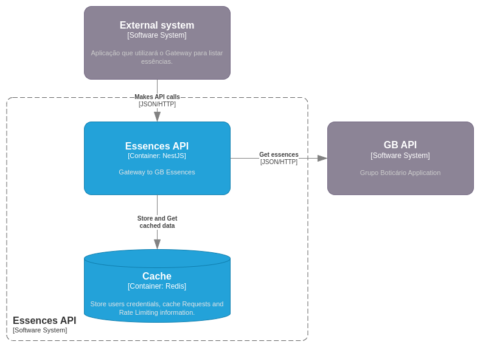

# Design Document - Essences API

## Índice

- [1. Resumo do Projeto](#1-resumo-do-projeto)
    - [1.1. Objetivo](#11-objetivo)
    - [1.2. Escopo](#12-escopo)
- [2. Arquitetura](#2-arquitetura)
    - [2.1. Diagrama C4](#21-diagrama-c4)
    - [2.2. Diagramas de Sequência](#22-diagramas-de-sequência)
        - [2.2.1 Listagem de todas as essências](#221-listagem-de-todas-as-essências)
        - [2.2.2 Consulta de uma essência por ID](#222-consulta-de-uma-essência-por-id)
- [3. Requisitos Funcionais](#3-requisitos-funcionais)
    - [3.1. Endpoints de listagem e consulta de Essências](#31-endpoints-de-listagem-e-consulta-de-essências)
    - [3.2. Cadastro de Usuários e Autenticação](#32-cadastro-de-usuários-e-autenticação)
- [4. Requisitos de Não Funcionais](#4-requisitos-de-não-funcionais)
    - [4.1. Desempenho](#41-desempenho)
    - [4.2. Segurança](#42-segurança)
        - [4.2.1. Autenticação](#421-autenticação)
        - [4.2.2. Rate Limiting](#422-rate-limiting)
        - [4.2.3. Logs](#423-logs)

## 1. Resumo do Projeto

### 1.1. Objetivo

O objetivo desta aplicação é simular um gateway para a listagem de essências do GB (Grupo Boticário). A intenção é
demonstrar conceitos de **Rate limiting**, **Cache de requisições** e **Autenticação JWT**. Além disso, a API também tem
o propósito de demonstrar como o código pode ser organizado e documentado, utilizando boas práticas de escrita de
código, como SOLID, TDD e Clean Code.

### 1.2. Escopo

A API criada com o Framework [NestJS](https://docs.nestjs.com) contém 4 endpoints: Listagem de Essências, Consulta de
uma Essência por ID, Criação de usuários e Autenticação.

> Os endpoints de **Criação de usuários** e **Autenticação** foram criados para facilitar a demonstração do conceito de
**Autenticação JWT**, caso contrário seria necessário utilizar sempre as mesmas credencias de acesso para os endpoints
> de Essências.

## 2. Arquitetura

### 2.1. Diagrama C4



### 2.2. Diagramas de Sequência

#### 2.2.1 Listagem de todas as essências


#### 2.2.2 Consulta de uma essência por ID


## 3. Requisitos Funcionais

### 3.1. Endpoints de listagem e consulta de Essências

- **Listagem de essências do GB:** Endpoint que lista todas as essências do GB.

```
Endpoint: GET /api/v1/essences

Headers:
- Authorization: "Bearer <token>"

Response 200:
[
    {
        "id": "FEONCB",
        "name": "Fazemos os olhos dos nossos clientes brilharem"
    },
    ...
]
```

- **Consulta uma essência pelo ID:** Endpoint que consulta uma essência pelo ID para detalhar o significado de cada
  essência.

```
Endpoint: GET /api/v1/essences/:id

Path Variables:
- id: "SI"

Headers:
- Authorization: "Bearer <token>"

Response 200:
{
    "id": "SI",
    "name": "Somos inquietos",
    "values": [
        "AUTODESENVOLVIMENTO",
        "EMPREENDEDORISMO",
        "ADAPTABILIDADE"
    ]
}
```

### 3.2. Cadastro de Usuários e Autenticação

- **Criação de usuários:** Endpoint para criar um novo usuário no sistema.

```
Endpoint: POST /api/v1/auth/sign-up

Body:
{
    "user": "AnyUser",
    "password": "AnyPassword"
}

Response 201: {}
```

- **Autenticação:** Endpoint para autenticar um usuário no sistema.

```
Endpoint: POST /api/v1/auth/sign-in

Body:
{
    "user": "AnyUser",
    "password": "AnyPassword"
}

Response 200:
{
    "token": "token-jwt",
    "ttl": 3600
}
```

## 4. Requisitos de Não Funcionais

### 4.1. Desempenho

A aplicação utiliza um cache para otimizar o desempenho das requisições de consulta de essências. Esse cache utiliza o
Redis como estrutura de dados, para permitir que o sistema escale de maneira eficiente.

Para gerenciamento do cache, foram utilizadas a bibliotecas `@nestjs/cache-manager` e `cache-manager`, seguindo as
recomendações de [Caching](https://docs.nestjs.com/techniques/caching) do NestJS.

### 4.2. Segurança

#### 4.2.1. Autenticação

A autenticação é realizada por um token JWT com tempo de expiração configurável via variáveis de ambiente. O token deve
ser enviado no header das requisições de consulta de essências e, caso esteja inválido ou expirado, a aplicação
retornará um erro 401.

Para tornar mais simples o desenvolvimento da API, os dados de usuários ficam armazenados apenas no cache, dispensando a
configuração de um banco de dados e ORM no projeto. Devido a isso, caso o servidor de cache seja reiniciado todos os
usuários serão removidos. Vale lembrar que essa abordagem foi utilizada apenas porque a aplicação não foi desenvolvida
para uso em ambiente real.

#### 4.2.2. Rate Limiting

As requisições para listagem de essências e consulta de essências possuem controle de Rate Limiting, limitando o acesso
à 5 requisições por minuto por endpoint. O tempo e a quantidade de acessos podem ser alterados via variáveis de
ambiente.

O gerenciamento de Rate Limiting é realizado pela biblioteca `@nestjs/throttler`, presente na documentação oficial do
NestJS: [Rate Limiting](https://docs.nestjs.com/security/rate-limiting#rate-limiting)

#### 4.2.3. Logs

Foram adicionados logs no código para marcar o início e fim de cada etapa processada, facilitando o troubleshooting em caso de falhas. Também é possível ajustar o nível de log, permitindo registrar apenas erros quando necessário.

A biblioteca utilizada para gerenciamento dos logs é a `nestjs-pino`, é um logger rápido e eficiente para aplicações NestJS, baseado no [Pino](https://github.com/pinojs/pino). Ela facilita o gerenciamento de logs estruturados, com suporte a níveis de log configuráveis, como debug e error, além de permitir a integração com o contexto da aplicação, como IDs de requisições. 

Os logs seguem o seguinte formato:
```json
{
   "req":{
      "requestId": "ebadee37-fd62-4fa7-abee-1d358fecf018",
      "method":"GET",
      "url":"/api/v1/essences"
   },
   "res":{
      "statusCode":200
   },
   "responseTime":571
}
```
